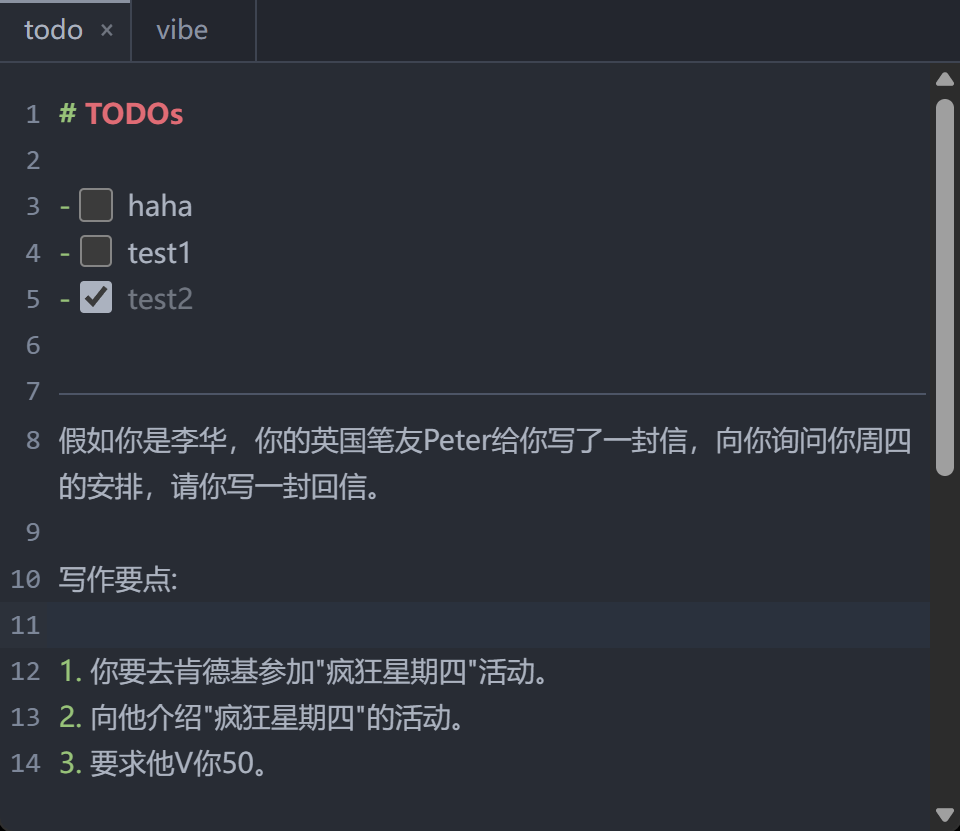

# snippets

一个简便的记事本。

> [!NOTE]
> 本项目完全是 vibecoding 的产物。目标为快速构建出一个符合需求的工具。其实现细节，并未深究。

## 背景

我需要一个简单的文本编辑器：
- 可以暂存我的一些markdown草稿。让我不用害怕一不小心多按一个enter就把消息框没写完的文本发给AI。
- 有符合我个人习惯的快捷键设计。
- 支持中文分词。（非常重要！）

## 预览



## 开发、安装

从源码构建需要：Node.js 20+、Rust stable。

```bash
npm install          # 安装依赖
npm run tauri dev    # 开发模式（前端热重载）
npm run tauri build  # 构建发布版 exe（内部先跑 tsc + vite）
npm run build        # 仅构建前端
npm test             # 单元测试
npm run icon         # 重新生成应用图标（light + dark 两套）
```

- **产物**：`src-tauri/target/release/snippets.exe`
- **平台**：基于 Tauri 2，可构建 Windows / macOS / Linux；当前主要发布 Windows 便携版
- **安装 / 使用**：无需安装——把 exe 拷到目标机器，直接运行即可。笔记就是 exe 旁顶层目录的一叠 `*.md` 文件，会话状态存 `settings.json`；备份 / 迁移 = 拷走整个文件夹，删除 `settings.json` 即恢复全部默认设置

## 快捷键

### 文件与标签页

| 按键 | 效果 |
| --- | --- |
| `Ctrl+O` | 打开文件面板：列出 exe 旁全部可打开的 `.md`，可输入过滤；已打开项带圆点，选中即切换 |
| `Ctrl+N` | 新建 `Untitled.md`（重名自动递增为 `Untitled-1.md` …） |
| `Ctrl+W` | 关闭当前标签页（关完最后一个停留在提示页，应用不退出） |
| `Ctrl+Tab` / `Ctrl+Shift+Tab` | 下一个 / 上一个标签页 |
| `Ctrl+1` … `Ctrl+8` / `Ctrl+9` | 跳到第 1…8 个标签页 / 最后一个 |

### 编辑

| 按键 | 效果 |
| --- | --- |
| `Enter` | 在列表 / 引用行内自动延续 `-`、`>` 等前缀 |
| `Ctrl+Enter` | 在下方插入空行，光标移入新行（不拆分原行） |
| `Ctrl+Shift+Enter` | 在上方插入空行，光标移入新行（不拆分原行） |
| `Tab` / `Shift+Tab` | 整行缩进 / 取消缩进（不插入 Tab 字符） |
| `Alt+↑` / `Alt+↓` | 上移 / 下移当前行（有选区则整体移动选区） |
| `Ctrl+Z` / `Ctrl+Y` | 撤销 / 重做 |
| `Ctrl+A` | 选中光标所在 block（单独成行的 `---` 为分块线，归属其上方 block；光标在分块线上则选中上方整个 block）；再次按下则全选全文 |

### 光标与选区（中文分词）

| 按键 | 效果 |
| --- | --- |
| `Ctrl+←` / `Ctrl+→` | 光标按词移动（中文按词分词） |
| `Ctrl+Shift+←` / `Ctrl+Shift+→` | 按词扩展选区 |
| `Ctrl+Backspace` / `Ctrl+Delete` | 按词删除 |

### 界面与设置

| 按键 | 效果 |
| --- | --- |
| `Ctrl+=` / `Ctrl+-` | 放大 / 缩小界面（5% 一步，范围 50%–200%） |
| `Ctrl+0` | 界面缩放重置为 100% |
| `Ctrl+,` | 打开设置：字号、主题（亮 / 暗 / 跟随系统）、分词引擎、界面缩放 |
